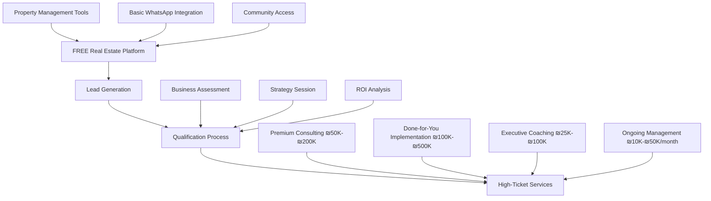
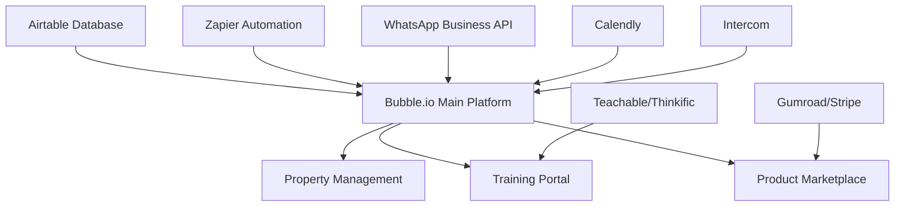
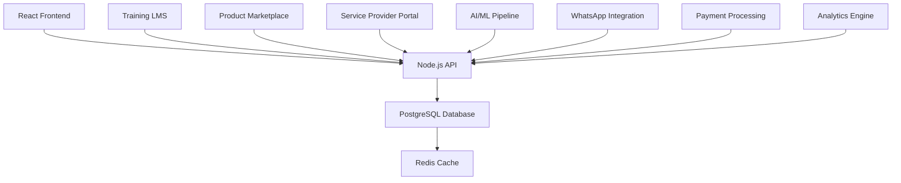
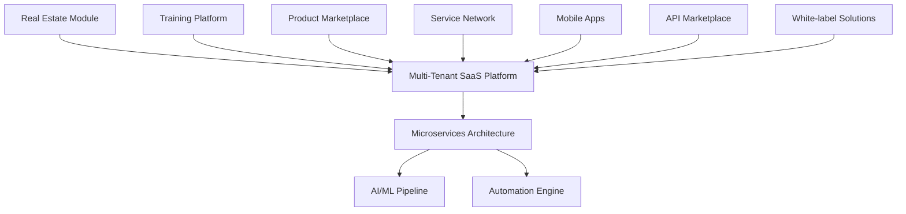

# RBS Real Estate Technology Platform + Business Automation Ecosystem
## Comprehensive Technical Architecture & Implementation Plan

### Executive Summary

Based on your WhatsApp analysis showing RBS Property Group as the highest-priority opportunity (Priority Score: 18, Revenue Potential: $5M+ annually), this plan designs a high-ticket consulting and services ecosystem that uses:

1. **Real Estate Platform** - Free lead magnet and credibility builder
2. **Premium Consulting Services** - High-value automation and business optimization
3. **Done-for-You Implementation** - Complete automation system setup and management
4. **Executive Training Programs** - High-ticket group and private coaching

**Target Market**: High-net-worth Orthodox Jewish business owners + Real estate professionals globally
**Business Model**: High-ticket services (₪25,000-₪500,000 per client) with free platform as lead magnet
**Timeline**: 6-month rapid deployment focused on immediate high-value client acquisition
**Revenue Potential**: ₪15M+ ($4.5M+) annually with 50-100 premium clients

---

## 1. Business Ecosystem Architecture

### High-Ticket Service Strategy
The real estate platform serves as a **free lead magnet** to attract high-value clients for premium consulting and implementation services.

### High-Ticket Revenue Streams

**Primary Revenue Streams:**
1. **Strategic Consulting**: ₪50,000-₪200,000 per 3-6 month engagement
2. **Done-for-You Implementation**: ₪100,000-₪500,000 per complete system
3. **Executive Coaching Programs**: ₪25,000-₪100,000 per 6-12 month program
4. **Ongoing Management Services**: ₪10,000-₪50,000 per month
5. **Mastermind Groups**: ₪15,000-₪50,000 per year per member
6. **Speaking & Workshops**: ₪10,000-₪50,000 per event

---

## 2. Comprehensive Feature Specifications

### 2.1 Real Estate Platform Core (Customer Acquisition Engine)

**Property Management Suite:**
- Multi-language property listings (Hebrew/English)
- AI-powered tenant matching and screening
- Automated lease management and renewals
- Financial tracking and reporting
- Maintenance request automation
- WhatsApp-native communication

**Advanced Analytics Dashboard:**
- Market trend analysis and pricing optimization
- Tenant behavior predictions
- Property performance metrics
- ROI calculations and forecasting
- Seasonal demand patterns (July-August peak analysis)

### 2.2 AI/Automation Product Marketplace

**Ready-to-Deploy Solutions:**

**1. Real Estate Chatbots (₪3,000-₪8,000 each)**
- Property inquiry automation
- Tenant screening chatbots
- Maintenance request handlers
- Rent collection reminders
- Multi-language support (Hebrew/English)

**2. Workflow Automation Packages (₪2,000-₪15,000 each)**
- Lead qualification pipelines
- Document collection and processing
- Appointment scheduling automation
- Email marketing sequences
- Social media posting automation

**3. Data Analytics Tools (₪5,000-₪25,000 each)**
- Market analysis dashboards
- Competitor monitoring systems
- Customer behavior analytics
- Financial performance tracking
- Predictive maintenance algorithms

**4. WhatsApp Business Automation (₪1,500-₪10,000 each)**
- Automated response systems
- Group management tools
- Broadcast messaging platforms
- Customer service automation
- Integration with CRM systems

### 2.3 Business Training & Education Services

**Training Program Tiers:**

**Beginner Level (₪1,500-₪3,000 per course)**
- "WhatsApp Business Automation Fundamentals"
- "No-Code Real Estate Tools Setup"
- "Basic Chatbot Creation Workshop"
- "Property Management Automation Basics"

**Intermediate Level (₪3,000-₪8,000 per course)**
- "Advanced AI Chatbot Development"
- "Real Estate Data Analytics Mastery"
- "Multi-Platform Automation Integration"
- "Customer Journey Automation Design"

**Advanced Level (₪8,000-₪15,000 per course)**
- "Custom AI Solution Development"
- "Enterprise Automation Architecture"
- "Real Estate Tech Stack Optimization"
- "Scaling Automation Businesses"

**Certification Programs (₪5,000-₪20,000)**
- "Certified Real Estate Automation Specialist"
- "WhatsApp Business Expert Certification"
- "AI-Powered Property Management Professional"

### 2.4 High-Ticket Consulting & Implementation Services

**Premium Service Tiers:**

**Strategic Business Transformation (₪100,000-₪300,000 per engagement)**
- Complete business process re-engineering
- Custom automation ecosystem design
- 6-12 month implementation with guaranteed ROI
- Executive team training and change management
- Ongoing optimization and support

**Done-for-You Real Estate Empire (₪200,000-₪500,000 per project)**
- Complete property management automation
- Custom platform development and deployment
- WhatsApp Business integration and optimization
- Team training and operational setup
- 24-month success guarantee

**Executive Coaching & Mastermind (₪50,000-₪150,000 per year)**
- Private 1-on-1 coaching sessions
- Exclusive mastermind group access
- Deal flow and investment opportunities
- Direct access to expert network
- Quarterly in-person retreats

### 2.5 Premium Network & Partnerships

**Exclusive Service Network:**
- Vetted high-end service providers only
- Premium legal services (₪1,000+/hour specialists)
- Elite financial advisors and wealth managers
- Luxury property management and concierge
- Executive-level business consulting

**Partnership Revenue Model:**
- Exclusive referral fees: 15-25% of service value
- Joint venture partnerships on large projects
- White-label service delivery agreements
- Strategic alliance revenue sharing

---

## 3. Technical Architecture

### Phase 1: MVP Foundation (Months 1-3)
**No-Code/Low-Code Ecosystem**

**Core Technology Stack:**
- **Frontend**: Bubble.io for main platform + Teachable for training
- **Database**: Airtable with advanced relational structure
- **Automation**: Zapier + Make.com for complex workflows
- **Payments**: Stripe + Israeli payment gateways
- **Communication**: WhatsApp Business API + Twilio
- **Training**: Teachable or Thinkific integration
- **Analytics**: Google Analytics + Mixpanel + Custom dashboards

### Phase 2: Hybrid Development (Months 4-8)
**Custom Components + Marketplace Integration**

### Phase 3: Enterprise Ecosystem (Months 9-12)
**Full Custom Platform with AI/ML**

---

## 4. Business Model & Revenue Projections

### Multi-Stream Revenue Model

**Year 1 Revenue Breakdown:**

| Revenue Stream | Monthly Target | Annual Revenue |
|----------------|----------------|----------------|
| Real Estate SaaS | ₪150,000 | ₪1,800,000 |
| AI/Automation Products | ₪100,000 | ₪1,200,000 |
| Training Programs | ₪80,000 | ₪960,000 |
| Consulting Services | ₪120,000 | ₪1,440,000 |
| Service Marketplace | ₪50,000 | ₪600,000 |
| **Total Year 1** | **₪500,000** | **₪6,000,000** |

**Year 2 Revenue Projections:**

| Revenue Stream | Monthly Target | Annual Revenue |
|----------------|----------------|----------------|
| Real Estate SaaS | ₪300,000 | ₪3,600,000 |
| AI/Automation Products | ₪250,000 | ₪3,000,000 |
| Training Programs | ₪200,000 | ₪2,400,000 |
| Consulting Services | ₪300,000 | ₪3,600,000 |
| Service Marketplace | ₪150,000 | ₪1,800,000 |
| White-label Solutions | ₪100,000 | ₪1,200,000 |
| **Total Year 2** | **₪1,300,000** | **₪15,600,000** |

### Product Pricing Strategy

**AI/Automation Products:**

**Starter Packages (₪1,500-₪3,000)**
- Basic WhatsApp chatbot templates
- Simple workflow automation
- Email marketing sequences
- Social media posting automation

**Professional Packages (₪5,000-₪15,000)**
- Advanced AI chatbots with NLP
- Multi-platform automation workflows
- Custom analytics dashboards
- Integration with multiple systems

**Enterprise Solutions (₪20,000-₪100,000)**
- Custom AI development
- Complete automation ecosystems
- White-label platform solutions
- Ongoing support and maintenance

**Training Programs:**

**Online Courses (₪500-₪2,000)**
- Self-paced video training
- Downloadable resources
- Community access
- Basic certification

**Live Workshops (₪2,000-₪5,000)**
- Interactive group training
- Hands-on implementation
- Direct Q&A sessions
- Advanced certification

**Private Consulting (₪10,000-₪50,000)**
- One-on-one strategy sessions
- Custom implementation planning
- Ongoing mentorship
- Guaranteed results programs

---

## 5. Implementation Roadmap

### Phase 1: Foundation & MVP (Months 1-3)

**Month 1: Platform Setup**
- [ ] Business registration and legal setup in Israel
- [ ] Core technology stack implementation (Bubble.io + Airtable)
- [ ] WhatsApp Business API setup and verification
- [ ] Basic real estate platform features
- [ ] Payment processing integration
- [ ] Hebrew/English language support

**Month 2: Product Development**
- [ ] First AI chatbot templates creation
- [ ] Basic workflow automation packages
- [ ] Training content development (first 3 courses)
- [ ] Service provider onboarding system
- [ ] Beta testing with RBS Property Group members
- [ ] Marketing website and materials

**Month 3: Launch & Validation**
- [ ] Soft launch to RBS community
- [ ] First paying customers onboarded
- [ ] Initial training program delivery
- [ ] Feedback collection and iteration
- [ ] Performance monitoring setup
- [ ] Revenue optimization testing

### Phase 2: Scale & Expansion (Months 4-8)

**Month 4-5: Product Expansion**
- [ ] Advanced AI chatbot development
- [ ] Custom workflow automation services
- [ ] Expanded training curriculum (10+ courses)
- [ ] Service marketplace launch
- [ ] Mobile app development
- [ ] International market research

**Month 6-7: Market Penetration**
- [ ] Orthodox Jewish community expansion (NY, London, Toronto)
- [ ] Real estate professional market entry
- [ ] Partnership development with agencies
- [ ] White-label solution development
- [ ] Advanced analytics implementation
- [ ] Customer success automation

**Month 8: Optimization**
- [ ] Platform performance optimization
- [ ] Advanced AI/ML feature implementation
- [ ] Enterprise customer onboarding
- [ ] Scalability improvements
- [ ] International expansion preparation
- [ ] Series A funding preparation

### Phase 3: Enterprise & Global (Months 9-12)

**Month 9-10: Enterprise Platform**
- [ ] Custom platform development completion
- [ ] Enterprise-grade security implementation
- [ ] Advanced AI/ML pipeline deployment
- [ ] White-label solution launch
- [ ] API marketplace development
- [ ] International market entry

**Month 11-12: Global Expansion**
- [ ] Multi-country platform deployment
- [ ] Local partnership establishment
- [ ] Advanced training certification programs
- [ ] Enterprise consulting services launch
- [ ] IPO preparation planning
- [ ] Global brand establishment

---

## 6. Customer Acquisition Strategy

### Multi-Channel Approach

**1. Real Estate Platform as Lead Magnet**
- Free basic property management tools
- Freemium model with premium AI features
- Community-driven growth through RBS network
- Referral programs with incentives

**2. Content Marketing & Education**
- Hebrew/English blog content
- YouTube training videos
- Webinar series on automation
- Case studies and success stories

**3. Community Engagement**
- WhatsApp group partnerships
- Orthodox Jewish community events
- Real estate conference participation
- Industry publication contributions

**4. Strategic Partnerships**
- Real estate agency partnerships
- Technology vendor collaborations
- Training organization alliances
- Service provider network expansion

### Customer Journey Optimization

**Stage 1: Awareness (Real Estate Platform)**
- Free property listing tools
- Basic WhatsApp automation
- Educational content consumption
- Community engagement

**Stage 2: Interest (Training & Education)**
- Free mini-courses and webinars
- Email marketing sequences
- Personalized automation assessments
- Success story sharing

**Stage 3: Consideration (Products & Services)**
- Free trials of AI tools
- Consultation calls
- Custom demos and presentations
- ROI calculations and projections

**Stage 4: Purchase (Full Ecosystem)**
- Starter package purchases
- Training program enrollment
- Consulting service engagement
- Long-term partnership development

**Stage 5: Advocacy (Referrals & Expansion)**
- Success story documentation
- Referral program participation
- Community leadership roles
- Partnership opportunities

---

## 7. Competitive Advantages

### Unique Value Propositions

**1. Community-Native Approach**
- Deep understanding of Orthodox Jewish business culture
- Hebrew/English bilingual support
- WhatsApp-first communication strategy
- Trust-based relationship building

**2. Comprehensive Ecosystem**
- End-to-end solution from property management to business automation
- Multiple revenue streams and customer touchpoints
- Integrated training and implementation services
- Ongoing support and optimization

**3. AI/Automation Expertise**
- Cutting-edge technology implementation
- Custom solution development capabilities
- Proven track record with real estate applications
- Scalable and replicable methodologies

**4. Data-Driven Intelligence**
- WhatsApp conversation analysis capabilities
- Market trend prediction and optimization
- Customer behavior insights and personalization
- Continuous improvement through analytics

### Competitive Differentiation

**vs. Traditional Real Estate Software:**
- Community-focused rather than generic
- AI-powered automation vs. basic tools
- Comprehensive ecosystem vs. single-purpose solutions
- Training and education vs. software-only

**vs. General Automation Platforms:**
- Real estate specialization and expertise
- Community-specific customization
- Hebrew/English bilingual support
- Proven market validation through WhatsApp analysis

**vs. Training/Consulting Companies:**
- Integrated platform for immediate implementation
- Real-world application through property management
- Ongoing revenue through software subscriptions
- Community network for referrals and growth

---

## 8. Risk Assessment & Mitigation

### Business Risks

**Market Competition**
- **Risk**: Established players entering the market
- **Mitigation**: Community-first approach, rapid feature development, strong relationships

**Technology Scalability**
- **Risk**: Platform limitations with rapid growth
- **Mitigation**: Phased development approach, modular architecture, cloud-native design

**Customer Acquisition Costs**
- **Risk**: High CAC reducing profitability
- **Mitigation**: Community-driven growth, referral programs, content marketing

### Operational Risks

**Team Scaling**
- **Risk**: Difficulty hiring qualified Hebrew-speaking developers
- **Mitigation**: Remote team strategy, outsourcing partnerships, training programs

**Quality Control**
- **Risk**: Inconsistent service delivery across multiple streams
- **Mitigation**: Standardized processes, quality assurance systems, customer feedback loops

**Regulatory Compliance**
- **Risk**: Changes in Israeli business or data protection laws
- **Mitigation**: Legal advisory board, compliance-first development, regular audits

### Financial Risks

**Cash Flow Management**
- **Risk**: Multiple revenue streams with different payment cycles
- **Mitigation**: Diversified revenue portfolio, subscription-based income, financial planning

**Currency Fluctuations**
- **Risk**: International expansion affected by exchange rates
- **Mitigation**: Multi-currency pricing, hedging strategies, local partnerships

---

## 9. Success Metrics & KPIs

### Platform Metrics

**Real Estate Platform:**
- Monthly Active Users (MAU)
- Properties listed and rented
- Customer acquisition cost (CAC)
- Customer lifetime value (CLV)
- Monthly recurring revenue (MRR)

**AI/Automation Products:**
- Product sales volume and revenue
- Customer satisfaction scores
- Implementation success rates
- Repeat purchase rates
- Referral generation

**Training Programs:**
- Course enrollment and completion rates
- Student satisfaction and outcomes
- Certification achievement rates
- Career advancement tracking
- Community engagement levels

**Consulting Services:**
- Project completion rates and satisfaction
- Client retention and expansion
- Revenue per consultant hour
- Referral generation from clients
- Long-term partnership development

### Business Health Indicators

**Financial Metrics:**
- Total revenue growth (month-over-month)
- Revenue diversification across streams
- Gross margin by revenue stream
- Customer acquisition cost vs. lifetime value
- Cash flow and profitability

**Operational Metrics:**
- Platform uptime and performance
- Customer support response times
- Feature adoption rates
- User engagement and retention
- Team productivity and satisfaction

**Market Position:**
- Market share in target segments
- Brand recognition and reputation
- Competitive positioning
- Partnership development
- International expansion progress

---

## 10. Next Steps Action Plan

### Immediate Actions (Next 30 Days)

**Week 1: Business Foundation**
- [ ] Register business entity in Israel
- [ ] Set up business banking and accounting
- [ ] Apply for WhatsApp Business API access
- [ ] Purchase domains and set up hosting
- [ ] Create project management system

**Week 2: Technology Setup**
- [ ] Configure Bubble.io development environment
- [ ] Set up Airtable database structure
- [ ] Implement basic Hebrew/English support
- [ ] Configure payment processing systems
- [ ] Set up analytics and tracking

**Week 3: Content Development**
- [ ] Create first AI chatbot templates
- [ ] Develop basic workflow automation packages
- [ ] Write training course outlines
- [ ] Design marketing materials
- [ ] Prepare beta testing program

**Week 4: Community Engagement**
- [ ] Contact RBS Property Group administrators
- [ ] Recruit beta testing participants
- [ ] Schedule initial customer interviews
- [ ] Launch social media presence
- [ ] Begin content marketing efforts

### 60-Day Milestone Targets

**Technical Milestones:**
- Functional real estate platform with core features
- 3 AI chatbot templates ready for sale
- 2 workflow automation packages completed
- First training course launched
- WhatsApp integration operational

**Business Milestones:**
- 10+ beta customers onboarded
- First revenue generated (₪10,000+)
- 50+ properties listed in system
- 5+ service providers in marketplace
- Initial training program delivered

### 90-Day Success Criteria

**Platform Metrics:**
- 100+ active users on real estate platform
- ₪50,000+ monthly recurring revenue
- 20+ AI/automation products sold
- 50+ training program enrollments
- 10+ consulting clients engaged

**Market Validation:**
- Positive community feedback and testimonials
- Organic growth through referrals
- Media coverage in Israeli tech/real estate publications
- Interest from potential investors or partners
- Expansion opportunities identified

---

## Conclusion

This comprehensive business ecosystem leverages your WhatsApp analysis insights to create a multi-faceted platform that serves as both a valuable real estate solution and a powerful customer acquisition engine for AI/automation products and services.

The phased approach minimizes risk while maximizing speed to market, and the multiple revenue streams provide both stability and growth potential. The community-focused strategy, combined with cutting-edge technology and comprehensive training offerings, creates a defensible competitive position with significant barriers to entry.

**Total Addressable Market**: $50M+ annually across all revenue streams
**Projected 3-Year Revenue**: ₪50M+ ($15M+)
**Investment Required**: ₪500,000-₪1,000,000 ($150,000-$300,000)
**ROI Potential**: 15-30x over 3 years

This ecosystem positions you to capture not just the immediate real estate opportunity but to build a lasting business that serves the broader Orthodox Jewish community while expanding into global markets with proven, scalable solutions.