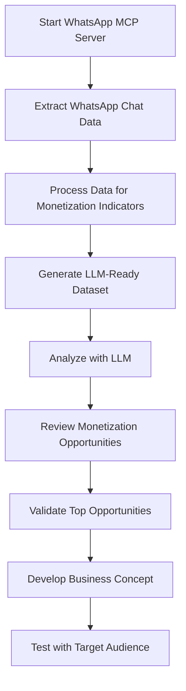

# WhatsApp Chat Monetization Workflow

This document outlines the workflow for extracting monetization opportunities from WhatsApp chats. Follow these steps to go from raw WhatsApp data to actionable business insights.

## Complete Workflow Overview

## Step 1: Data Extraction and Processing

Start by extracting data from your WhatsApp chats:

1. **Start the WhatsApp MCP Server**
   - Run the PowerShell script: `.\start_server_and_extract.ps1`
   - This will start the WhatsApp MCP server and run the extraction

   Or manually:
   - First start the server: `python C:\Users\elie\OneDrive\Documents\Cline\MCP\whatsapp-mcp\whatsapp-mcp-server\main.py`
   - Then run extraction: `python extract_whatsapp_data.py` or run `run_extraction.bat`

2. **Choose Your Extraction Options**
   - Extract all chats: `python extract_whatsapp_data.py`
   - Extract limited chats: `python extract_whatsapp_data.py --max-chats 20`
   - Extract recent history: `python extract_whatsapp_data.py --max-history 72`

3. **Review Extraction Results**
   - Check the `extracted_data` directory for the output files
   - Review the extraction summary displayed after processing

## Step 2: LLM Analysis for Monetization Opportunities

Analyze the extracted data to identify monetization opportunities:

1. **Run LLM Analysis**
   - Use the analysis script: `python analyze_with_llm.py` or run `run_analysis.bat`
   - For focused analysis: 
     - Product focus: `python analyze_with_llm.py --prompt-type product_focus`
     - Service focus: `python analyze_with_llm.py --prompt-type service_focus`

2. **Review the Analysis Results**
   - Check the `llm_analysis_results.json` file for detailed results
   - Review the summary displayed in the console

## Step 3: Opportunity Validation and Development

Once you've identified promising opportunities, validate and develop them:

1. **Prioritize Opportunities**
   - Review the top 5 monetization opportunities
   - Rank based on:
     - Market size
     - Implementation complexity
     - Alignment with your skills and resources
     - Monetization potential

2. **Conduct Market Validation**
   - Survey members of relevant WhatsApp groups
   - Research existing solutions in the market
   - Estimate market size and competition
   - Identify unique value proposition

3. **Develop Business Model Canvas**
   - Customer segments
   - Value propositions
   - Revenue streams
   - Cost structure
   - Key activities and resources

4. **Create Minimum Viable Product (MVP)**
   - Build basic version of the solution
   - Test with a small subset of potential users
   - Gather feedback and iterate

## Sample Monetization Pathways

Based on typical WhatsApp chat patterns, here are common monetization pathways:

### Product Recommendation Platform

If your chats show frequent product recommendations and inquiries:

1. **Data Indicators:**
   - High frequency of "recommend", "where to buy", "looking for"
   - Specific product categories mentioned repeatedly
   - People sharing links to products

2. **Monetization Model:**
   - Affiliate marketing platform focused on frequently discussed products
   - Commission on sales from recommended products
   - Premium placement for vendors

3. **Implementation:**
   - Create category-specific recommendation lists
   - Build trust through community reviews
   - Integrate with e-commerce platforms

### Local Service Marketplace

If your chats show frequent service provider requests:

1. **Data Indicators:**
   - High frequency of "need someone to", "looking for a professional"
   - Service categories like plumbing, childcare, tutoring
   - Complaints about difficulty finding reliable providers

2. **Monetization Model:**
   - Subscription model for service providers
   - Booking fees or commission
   - Premium verification and promotion

3. **Implementation:**
   - Build a database of service providers from recommendations
   - Create a verification system
   - Develop a booking and review platform

### Community Deals Platform

If your chats show interest in discounts and deals:

1. **Data Indicators:**
   - Frequent sharing of sales, promotions, discount codes
   - Questions about where to find best prices
   - Group buying coordination

2. **Monetization Model:**
   - Commission from vendors
   - Premium membership for early access to deals
   - Sponsored promotions

3. **Implementation:**
   - Aggregate deals and organize by category
   - Negotiate exclusive discounts for platform members
   - Create time-limited group buying opportunities

## Privacy and Ethical Considerations

When implementing any monetization strategy:

- Anonymize personal data in your analysis
- Get consent before using chat data commercially
- Provide value to community members, not just extract it
- Be transparent about monetization methods
- Consider privacy implications of any implementation

## Technical Next Steps

1. **Integrate with Actual LLM API**
   - Modify `analyze_with_llm.py` to connect to an OpenAI, Anthropic, or other LLM API
   - Replace the simulation function with actual API calls

2. **Enhance Data Processing**
   - Improve keyword detection
   - Add sentiment analysis
   - Implement entity recognition for brands and products

3. **Develop Visualization Dashboard**
   - Create visualization of monetization opportunities
   - Build trend analysis over time
   - Generate category-specific insights

4. **Automated Reporting**
   - Set up scheduled extraction and analysis
   - Create regular reports on emerging opportunities
   - Track changes in monetization potential over time
